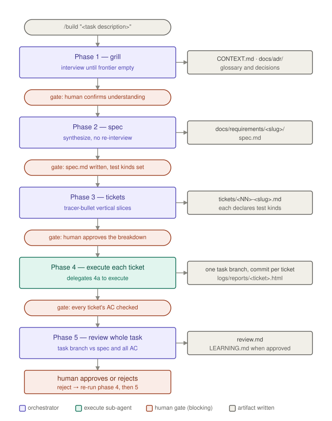
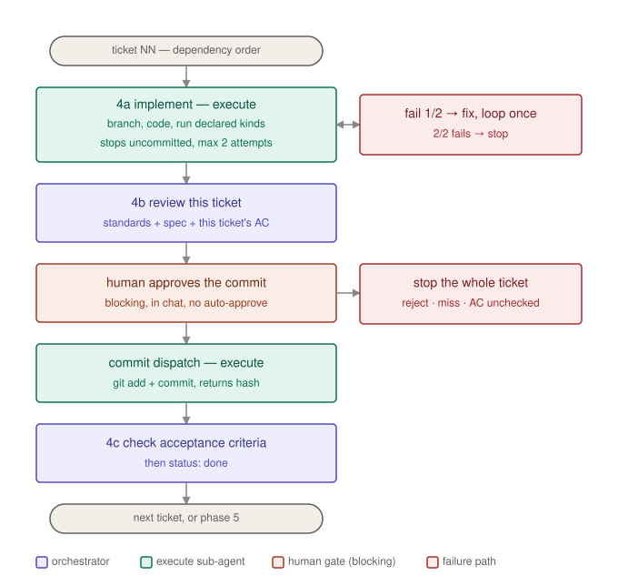

# agent-harness-template

A template for running AI-assisted development as a gated, 5-phase pipeline instead of one long-running single-agent session. The Orchestrator (main thread) grills, writes the spec and tickets, reviews, and checks acceptance criteria. Only implementation is delegated to the `execute` sub-agent.

## Why

Single-agent sessions drift: scope creeps, the agent grades its own homework, and context gets saturated with tool output. This harness splits the work into gated phases and hands off artifacts (spec.md, tickets, diffs, handoff logs) instead of full conversation history. `execute` never checks its own Acceptance Criteria.

## Workflow



Phase 1–3 and 5 all run on the orchestrator's own thread; only 4a leaves it.
It leaves it *twice* per ticket, because a sub-agent cannot block waiting on a
human answer — so the one approval checkpoint sits between the two dispatches:



The same flow as text, with the retry and stop paths spelled out

```
/build "<task description>"
  │
  ▼
Phase 1 — Grill (`grill-with-docs`) — orchestrator ↔ you, no skip/timeout
           grilling + domain-modeling → notes, CONTEXT.md, docs/adr/
  ▼
Phase 2 — Spec (`to-spec`) — orchestrator
           docs/requirements/<slug>/spec.md
  ▼
Phase 3 — Tickets (`to-tickets`) — orchestrator ↔ you (approve the breakdown
           and which tickets get e2e)
           docs/requirements/<slug>/tickets/<NN>-<slug>.md (one file per ticket,
           each declaring `Test kinds: unit[, integration[, e2e]]` — integration
           and e2e only once a connected FE↔BE↔DB flow exists in this repo)
  ▼
Phase 4 — per ticket, dependency order:
           4a  execute sub-agent, implement dispatch (loop, max 2 attempts)
               handoff log → checkout/create the task branch <slug> →
               implement → run every kind in `Test kinds` (host Bash)
                 pass → stop, uncommitted → return summary + test output → 4b
                 fail attempt 1 → fix, loop once
                 fail attempt 2 → STOP, ask you
           4b  orchestrator loads `.claude/rules/` (coding-standard + security)
               then reviews this ticket (code-review vs spec + this ticket's AC)
               then asks you, in chat, for approval to commit (blocking, no skip)
               approved → handoff log → execute, commit dispatch → commit
           4c  orchestrator checks `- [x]` on confirmed AC, then Status: done
           rejected approval / unmet AC → STOP, ask you
  ▼
Phase 5 — Review (whole task) vs spec + every ticket's AC
           docs/requirements/<slug>/review.md
  ▼
You approve/reject (manual, always)
  ├─ Approve → lessons appended to LEARNING.md, then the orchestrator
  │            recommends /create-pr (push <slug> + PR vs main — you run it)
  └─ Reject  → uncheck implicated AC, re-run Phase 4 for those tickets only,
               loop back to Phase 5
```


Orchestrator runbook: `CLAUDE.md`. Slash command: `.claude/commands/build.md`.
Diagram sources: `diagrams/` (hand-written SVG, no build step — edit the file
directly and keep it in step with `CLAUDE.md` when a phase or gate changes).

## Setup

Phase 4 is branch-per-**task**, not per ticket: the first ticket runs
`git checkout -b <slug> main` and every later ticket in the task just checks
that same branch out, landing one commit each. So a task with eight tickets
produces one branch and eight commits, and the review fixed points fall out of
that — `git diff HEAD` for a single ticket in 4b (earlier tickets are already
committed), `git diff main...HEAD` for the whole task in Phase 5.

That needs a git repo whose `main` already has **at least one commit** —
`git init` alone leaves an unborn `main` that nothing can branch off, so the
first commit is the part that actually matters.

Starting a new project from this template:

```bash
git clone <this-repo> my-project && cd my-project
rm -rf .git && git init -b main
git add -A && git commit -m "🎉 add: project scaffold from agent-harness-template"
```

The `rm -rf .git` is the point of that sequence: cloning hands you the
template's own history and remote, and you almost certainly want neither in
your project. Skip it and your first `/build` commits land on top of the
template's commits, pointed at the template's origin.

Then delete `.github/README.md` and write your project's own root
`README.md`. That stub exists because GitHub renders a repo's front page
only from a file named exactly `README.md`, checked in `.github/` first,
then the root, then `docs/` — there is no setting that points it at
`README-HARNESS.md`. Putting the stub in `.github/` leaves the root
`README.md` slot free for you, but it also **outranks** whatever you write
there, so your front page keeps showing this template until you remove it.
Keep this file along with `CLAUDE.md`, `.claude/` and `LEARNING.md` — those
are the harness.

Then adjust `.claude/rules/` for your stack before the first `/build` — the
`paths` globs and the example paths inside `coding-standard.md` §8/§10 are
placeholders, since the template ships with no application code for them to
match. In the harness these files are loaded by explicit `Read` at a fixed
path rather than by those globs, so a stale glob won't stop a rule from
loading — it just misleads any tooling outside the harness that attaches
rules by path.

Skill content lives directly in `.claude/skills/<name>/SKILL.md` — most of it
originates from [mattpocock/skills](https://github.com/mattpocock/skills) (MIT
licensed), vendored into this repo rather than fetched at setup time. To pull
in updates from upstream, copy the relevant `SKILL.md` file(s) over manually.

### No CI, no build tooling

The template deliberately ships with no `package.json`, no lockfile, and no
CI workflow. An earlier version had a `.github/workflows/ci.yml` plus Node
scripts that typechecked the harness's own TypeScript and rendered test
reports; all of it was removed along with the `tools/` and `scripts/`
directories it existed to serve, because a template shouldn't impose a
toolchain on the project that clones it. Nothing in Phase 1–5 depends on
that machinery: `execute` runs your project's own test commands through
`Bash` and writes `logs/reports/<ticket>.html` by hand.

So the gates in this harness are the ones described here — the human
approval ask in 4b, the AC checks in 4c, and the reviews in 4b/Phase 5 — and
none of them is enforced by a machine. If you want mechanical enforcement,
add your own CI and hooks for your stack; treat these rules as the
shift-left layer, not as a substitute for a pipeline that can actually block
a merge.

## Test kinds, integration and e2e

Every ticket declares its own `Test kinds:` line. `unit` is always the
floor. `integration` and `e2e` both require a real connected flow — front-
end through back-end through the database — to already exist in this
repo, because both mean testing across a boundary that only exists once
that wiring is in place. Early in a project, before that flow exists, the
floor is `unit` alone and no ticket declares `integration` or `e2e`, no
matter how much a ticket looks like it deserves one. Once the flow exists,
the floor becomes `unit, integration`, and `e2e` is added on top of that
only where the spec's `## Testing Decisions` criterion calls for it
(normally the ticket that *closes* a user-visible flow, not every ticket
in its chain). Which case a spec is in, and which tickets get `e2e` once
eligible, is a human's call, made once in the Phase 2 spec and the Phase 3
breakdown quiz and recorded in the ticket file; `execute` runs exactly
what the field declares and may never edit it, because that field is what
the 4b and Phase 5 gates check against — dropping or adding a kind would
delete the gate rather than satisfy it either way.

That's why "which tests" is data rather than a judgement call at
implementation time: an absent `e2e` row in a report has to mean "not
required here", and it can only mean that if something else already says
so. What the three words *mean* is itself project-specific — for an HTTP
API, `integration` often already drives the app in-process while `e2e`
means a running server against a real database, and some projects
legitimately have no third layer at all. Phase 1 pins those definitions
down in `CONTEXT.md` before any of this is assigned.

## Test evidence

`execute` runs every kind the ticket declares on the host via `Bash`, then
writes `logs/reports/<ticket>.html` itself directly with `Write` — a small
self-contained HTML file, one table per attempt, cumulative across
retries, one row per declared kind. There is no renderer script or
telemetry pipeline behind it: the sub-agent authors the file's HTML by
hand, which is enough for something this simple and adds no dependency. It
also reports the actual command plus per-kind pass/fail counts directly in
the summary it returns to the orchestrator (CLAUDE.md § 4a), and logs each
attempt as a row in that ticket's own `## Execution log` table
(`.claude/agents/execute.md`). The orchestrator reads both the HTML report
and that table during the 4b per-ticket review and the Phase 5 whole-task
review, and a kind the ticket declared but that shows up in neither is a
failed gate rather than a pass. `logs/reports/*.html`
is git-ignored per `git-convention.md` §5 — it's regenerated per run, not
committed.

## Running

```bash
claude
> /build add a GET /goodbye endpoint that mirrors /hello
```


## Handoff logs

Before every sub-agent call, the exact `{ subAgent, task, context }` payload is
written to `docs/requirements/<slug>/handoffs/<timestamp>-<subAgent>.json` —
the orchestrator writes this itself with `Write` before each dispatch.
Fallback: `logs/handoffs/` when the task slug cannot be inferred.

## How Phase 4a is dispatched

The orchestrator dispatches `execute` via the Agent tool with
`subagent_type: "execute"`, which loads `.claude/agents/execute.md` and
grants the real tools (`Read`, `Write`, `Edit`, `Bash`). The Agent tool
injects **no skill or rule content** — it loads the role file and grants
tools, full stop. So `execute` Reads `.claude/skills/{implement,tdd}/SKILL.md`
and `.claude/rules/*.md` itself, as the top of `.claude/agents/execute.md`
instructs — a sub-agent that never reads its own rules looks identical to one
following them, so there is no injection step to fall back on here.[tanaka@acme.co](mailto:tanaka@acme.co)

`execute` cannot pause mid-task for a human answer, so the orchestrator
dispatches it **twice per ticket**: once to implement and test (stopping
with the changes uncommitted), and again — only after the orchestrator has
reviewed the diff and asked the human for approval directly in chat — to
commit. See CLAUDE.md § Phase 4b.

## Directory map


| Path                        | Purpose                                                                                                                             |
| --------------------------- | ----------------------------------------------------------------------------------------------------------------------------------- |
| `README-HARNESS.md`         | This file — the harness's own documentation                                                                                         |
| `.github/README.md`         | Short pointer to this file, so GitHub's front page renders something; delete it and write your own root `README.md`                 |
| `diagrams/`                 | Workflow diagrams embedded above — hand-written SVG, no build step                                                                  |
| `CLAUDE.md`                 | Orchestrator runbook (always-loaded)                                                                                                |
| `.claude/skills/`           | Plain-text skill content the orchestrator and `execute` read directly                                                               |
| `.claude/commands/build.md` | Orchestrator prompt (the `/build` slash command)                                                                                    |
| `.claude/agents/execute.md` | `execute` role prompt + its real tool scope (`tools:` frontmatter)                                                                  |
| `.claude/harness.json`      | Harness config: `execution.mode`, `permissions` (mirrors `execute.md`'s tool scope), `approval.autoApprove`                         |
| `.claude/settings.json`     | Claude Code's own config (permission allowlist)                                                                                     |
| `.claude/rules/`            | Project coding/security/git rules — load at 4a (execute) and 4b/5 (review), not Phase 1–3. Adjust the example paths to your project |
| `CONTEXT.md` / `docs/adr/`  | Glossary and ADRs written during Phase 1                                                                                            |
| `docs/requirements/<slug>/` | spec.md / tickets/*.md / review.md / handoffs/*.json per task                                                                       |
| `logs/handoffs/`            | Fallback handoff logs when the task slug cannot be inferred                                                                         |
| `logs/reports/`             | Per-ticket HTML test reports, written directly by `execute` (git-ignored)                                                           |
| `LEARNING.md`               | Durable, curated lessons carried across runs                                                                                        |


